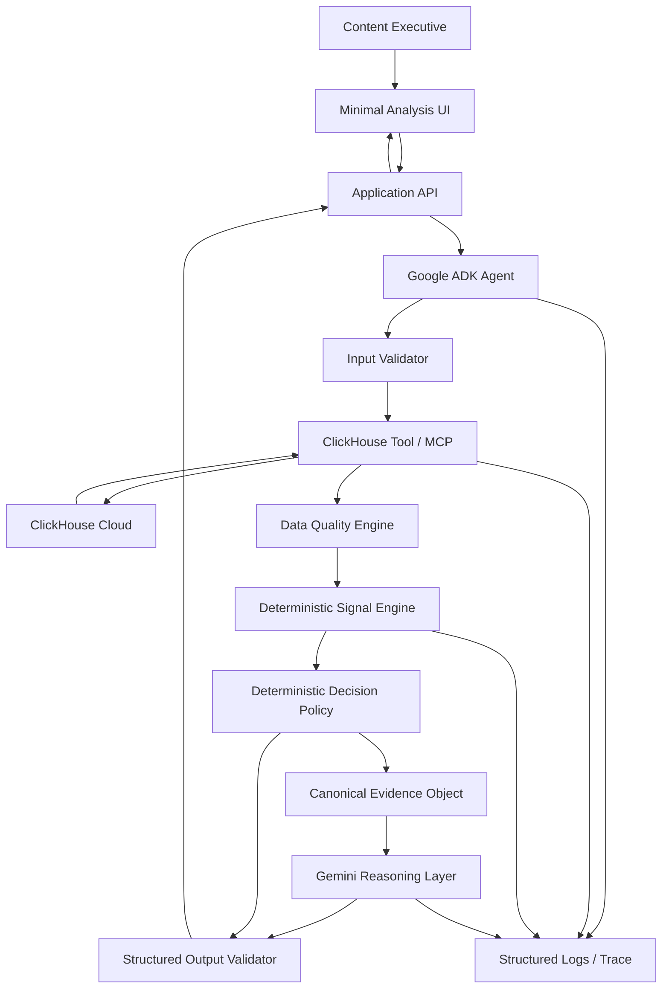

# Content Performance Signal Agent
## Master Build + Validation Specification

**Document status:** Build specification  
**Audience:** Coding agent / engineering agent  
**Hackathon track:** ClickHouse  
**Use case:** Media & Entertainment  
**Time budget:** 48–72 hours  
**Primary objective:** Build a working, judge-verifiable agent with genuine Google Cloud Agent Platform and ClickHouse runtime integrations.

---

## 0. Executive Directive to the Coding Agent

Build the **Content Performance Signal Agent** as a small, reliable, evidence-first agentic system for media and entertainment teams.

The core workflow is:

> **Content ID → retrieve real ClickHouse data → validate → deterministic signal computation → deterministic recommendation constraints → Gemini reasoning → structured recommendation → evidence-backed explanation**

The dashboard is optional and secondary. The agent and its real integrations are the product.

### Non-negotiable rules

1. Do not build the UI before the core agent workflow works.
2. Do not fabricate ClickHouse responses.
3. Do not replace production/demo integrations with mocks.
4. Synthetic data is allowed only if it is actually stored in ClickHouse and retrieved at runtime.
5. Quantitative metrics must be calculated by deterministic code/SQL, not invented by the LLM.
6. Gemini may interpret structured evidence but may not override data-quality gates or invent evidence.
7. The final recommendation must be reproducible from the same dataset and configuration.
8. The system must visibly distinguish:
   - raw data,
   - deterministic signals,
   - decision constraints,
   - LLM interpretation.
9. Every external integration must have a real integration test.
10. Every important quantitative rule must have unit tests.
11. Secrets must never be committed.
12. All hackathon requirements must be demonstrable from the repository, deployment, logs, or demo.
13. If a platform capability is uncertain, verify it before implementation rather than guessing.
14. If a proposed feature threatens the 48–72 hour deadline, cut it.

### Priority order

**Working agent > genuine integrations > reliability > validation > demo clarity > UI polish**

---

# 1. Product Definition

## 1.1 Product

The Content Performance Signal Agent is an agentic analytics workflow that answers:

> **“Given this piece of content, what is happening to its audience, what evidence supports that conclusion, and what should the content team investigate or do next?”**

The initial implementation focuses on episodic video/show content.

A user submits a content identifier such as:

```text
SHOW-042
```

The agent retrieves the relevant engagement data from ClickHouse, validates the evidence, computes deterministic signals, evaluates a configurable decision policy, and asks Gemini to turn the structured evidence into an executive explanation.

The result is not simply a chart or SQL answer. It is a structured decision packet.

Example:

```json
{
  "content_id": "SHOW-042",
  "recommendation": "REPOSITION",
  "confidence": 0.82,
  "decision_basis": {
    "acquisition": "WEAK",
    "retention": "DECLINING",
    "engagement": "STABLE",
    "data_quality": "SUFFICIENT"
  },
  "signals": [
    {
      "name": "episode_retention_decay",
      "value": 0.39,
      "interpretation": "Material retention decline across the season"
    },
    {
      "name": "new_viewer_trend",
      "value": -0.21,
      "interpretation": "New-viewer acquisition is declining"
    }
  ],
  "evidence": [
    "Episode 1 completion: 0.71",
    "Episode 3 completion: 0.43",
    "Returning viewers: stable"
  ],
  "warnings": [],
  "llm_reasoning": "...",
  "next_action": "Investigate episode-3 drop-off and test repositioning."
}
```

The exact numbers above are illustrative only. Runtime values must come from ClickHouse.

---

## 1.2 Target user

Primary target:

- Head of Content
- Content executive
- Programming executive
- Content strategy lead
- Streaming analytics lead

Secondary target:

- Analyst who prepares content-performance reviews for executives.

The product should not pretend that it replaces a data science or BI organization. Its narrower promise is:

> **Automate the repetitive path from raw content-performance data to a defensible first-pass decision.**

---

## 1.3 Problem

A normal analytics workflow often requires a person to:

1. identify the relevant content;
2. query or open analytics tools;
3. inspect views;
4. inspect completion;
5. compare episodes;
6. inspect retention;
7. look for changes;
8. determine whether changes are meaningful;
9. combine acquisition and retention evidence;
10. write an interpretation;
11. communicate a recommendation.

The problem is not that dashboards cannot show these metrics.

The problem is that the user must perform the interpretation workflow manually.

---

## 1.4 Why an agent instead of a dashboard?

A dashboard is appropriate when the user wants to explore data.

This product is appropriate when the user wants an answer to a decision-oriented question.

### Dashboard

```text
User → dashboard → filters → charts → interpretation → decision
```

### Agent

```text
User → content ID
     → agent retrieves evidence
     → validates evidence
     → computes signals
     → identifies meaningful patterns
     → reasons over evidence
     → returns recommendation
```

The agent is therefore useful only if it performs work that would otherwise require multiple queries and interpretation steps.

### Important product constraint

Do not claim that the agent is universally better than BI.

The correct positioning is:

> **BI helps experts explore. The agent packages a repeatable decision workflow around the data.**

---

# 2. Critical Product Challenge

The original concept is good enough for a hackathon but has several weaknesses.

## 2.1 Risk: “AI wrapper around SQL”

If the agent merely executes a query and asks Gemini to summarize the result, judges can reasonably ask:

> “Why isn't this just a dashboard with an LLM attached?”

### Required response

The system must have a genuine pipeline:

1. retrieve data;
2. validate it;
3. compute multiple deterministic signals;
4. classify the evidence;
5. apply a decision policy;
6. detect uncertainty;
7. pass a compact evidence object to Gemini;
8. generate reasoning constrained by that evidence.

The LLM is not the analytics engine.

---

## 2.2 Risk: arbitrary thresholds

Do not invent a large collection of arbitrary “industry standard” thresholds.

For the hackathon, use **configurable heuristic thresholds** and explicitly label them as demonstration policy parameters.

Example:

```yaml
decision_policy:
  minimum_viewers: 500
  retention:
    strong_positive: 0.10
    strong_negative: -0.15
  acquisition:
    positive_growth: 0.10
    negative_growth: -0.10
  engagement:
    positive_velocity: 0.10
    negative_velocity: -0.10
```

These values are not claims about the media industry. They are deterministic demo-policy defaults.

The system must allow changing them without rewriting the agent.

---

## 2.3 Risk: simplistic recommendations

“Good = renew, bad = cancel” is too shallow.

The system should distinguish at least:

| Acquisition | Retention | Interpretation | Default |
|---|---|---|---|
| Strong | Strong | Healthy demand and consumption | RENEW / PROMOTE |
| Weak | Strong | Audience quality may be good but reach is weak | PROMOTE / INVESTIGATE |
| Strong | Weak | Content attracts users but fails to retain them | REPOSITION / RE-EDIT |
| Weak | Weak | Broad underperformance | CANCEL / INVESTIGATE |
| Mixed | Mixed | Ambiguous evidence | INVESTIGATE |
| Any | Insufficient data | Cannot safely conclude | INVESTIGATE |

The deterministic engine should produce the default category. Gemini may explain it and suggest hypotheses, but should not silently change the policy result.

---

## 2.4 Risk: ClickHouse is artificially inserted

ClickHouse must be central to the workflow.

The demo must make this obvious:

```text
Agent
  ↓
ClickHouse tool
  ↓
Real query
  ↓
Real rows
  ↓
Signal engine
  ↓
Gemini
  ↓
Recommendation
```

Do not store a JSON fixture in the repository and pretend that it is ClickHouse data.

Synthetic data is acceptable, but:

> **Synthetic ≠ fake integration.**

The synthetic dataset must be inserted into ClickHouse and queried from ClickHouse during the demo.

---

## 2.5 Better product framing

The strongest version of this project is not:

> “AI analyzes content analytics.”

It is:

> **“An evidence-first content decision agent that turns live engagement data into a reproducible recommendation.”**

The memorable element should be the traceability:

```text
Recommendation
    ↓
Decision policy
    ↓
Signals
    ↓
Raw metrics
    ↓
ClickHouse query
```

A judge should be able to ask:

> “Where did that 39% decline come from?”

And the application should answer:

> “It was computed from these ClickHouse rows using this deterministic formula.”

That is more defensible than an LLM-generated analytics narrative.

---

# 3. Scope

## 3.1 MUST HAVE

- ClickHouse-backed synthetic media dataset
- Real ClickHouse runtime query
- ClickHouse MCP integration if compatible with the verified platform architecture
- Google Cloud Gemini Enterprise Agent Platform runtime
- Gemini reasoning
- Content ID input
- Data-quality validation
- Deterministic signal engine
- Configurable decision policy
- Structured output
- Evidence references
- Failure handling
- Automated tests
- Production/demo deployment
- Public repository
- OSS license
- Repeatable demo scenario
- 3-minute demo recording

---

## 3.2 SHOULD HAVE

- Clean analysis UI
- Agent execution trace
- Query/result visibility
- “Why this recommendation?” evidence panel
- One-click demo scenarios
- Evaluation report
- Health endpoint
- Structured logs

---

## 3.3 NICE TO HAVE

- Scheduled analysis
- Multiple content types
- Historical comparison UI
- Exportable report
- More sophisticated anomaly detection
- User-configurable policy
- A2A integration
- Persistent analysis history

---

## 3.4 CUT

Cut these first if time becomes limited:

- Authentication UI
- Complex user accounts
- Multi-tenant architecture
- Full BI dashboard
- Custom charting system
- Advanced forecasting
- Machine-learning model training
- Complex memory
- Mobile application
- Fine-grained permissions UI
- Large design system
- Multiple partner integrations
- Multiple LLM providers

---

# 4. Core User Workflow

## 4.1 Before

```text
1. Open analytics tooling.
2. Find the content.
3. Query or inspect viewership.
4. Query retention.
5. Compare episodes.
6. Inspect acquisition trends.
7. Inspect engagement.
8. Determine whether changes are meaningful.
9. Write interpretation.
10. Make a recommendation.
```

## 4.2 After

```text
1. Enter SHOW-042.
2. Agent validates the identifier.
3. Agent retrieves ClickHouse data.
4. Agent validates data quality.
5. Deterministic engine computes signals.
6. Decision policy classifies the evidence.
7. Gemini interprets the evidence.
8. Agent returns recommendation + rationale + evidence.
```

---

# 5. Agent Workflow Specification

## 5.1 State machine

The workflow should behave like a controlled state machine.

```text
RECEIVED
  ↓
VALIDATING_INPUT
  ↓
RETRIEVING_DATA
  ↓
VALIDATING_DATA
  ↓
COMPUTING_SIGNALS
  ↓
APPLYING_DECISION_POLICY
  ↓
LLM_INTERPRETATION
  ↓
VALIDATING_OUTPUT
  ↓
COMPLETED
```

Failure states:

```text
INPUT_ERROR
DATA_RETRIEVAL_ERROR
DATA_QUALITY_ERROR
LLM_ERROR
OUTPUT_VALIDATION_ERROR
TIMEOUT
```

Never silently continue after a critical failure.

---

# 6. Step 1 — Input Validation

Validate:

- `content_id`
- optional `content_type`
- optional date range
- optional analysis mode

For the hackathon, support:

```json
{
  "content_id": "SHOW-042",
  "content_type": "series"
}
```

Reject:

- empty IDs;
- IDs containing unsupported characters;
- excessively long input;
- unknown content IDs;
- unsupported date ranges.

Do not expose raw database errors to the user.

Return a structured error.

---

# 7. Step 2 — ClickHouse Data Retrieval

## 7.1 Integration strategy

Preferred architecture:

```text
Google Cloud-hosted agent
        ↓
ClickHouse MCP integration/tool
        ↓
ClickHouse Cloud
        ↓
media analytics tables
```

The exact transport must be verified against the current Google Agent Platform MCP/tooling capabilities before implementation.

ClickHouse currently maintains an official open-source MCP server exposing ClickHouse query functionality, including a read-oriented `run_query` tool and schema inspection tools. Its current repository documents HTTP/SSE transports and authentication configuration. Pin and verify a current release rather than assuming the version in older examples. [Source: ClickHouse MCP repository and release information.]

If Google Agent Platform can consume the ClickHouse MCP endpoint directly in the chosen deployment architecture, use that route.

If direct remote MCP consumption is not supported in the exact required runtime, implement a thin, explicitly documented MCP/tool adapter that still invokes the official ClickHouse MCP server or ClickHouse query interface at runtime.

Do not replace this with static fixtures.

---

## 7.2 ClickHouse connection

Production/demo configuration:

```text
CLICKHOUSE_HOST
CLICKHOUSE_PORT
CLICKHOUSE_USER
CLICKHOUSE_PASSWORD
CLICKHOUSE_DATABASE
CLICKHOUSE_SECURE
CLICKHOUSE_VERIFY
```

Use a dedicated least-privilege read-only user.

The application must never use an administrative ClickHouse account.

For ClickHouse Cloud, use the secure HTTPS interface as appropriate to the deployed client/MCP configuration.

---

## 7.3 Query design

Do not let the LLM freely generate arbitrary SQL for the core workflow.

Use deterministic query templates or a constrained query tool.

The core agent should request only the data required for the analysis.

Minimum dataset retrieval:

1. content metadata
2. episode performance
3. audience trend
4. engagement trend

Example parameterized query:

```sql
SELECT
    content_id,
    episode_number,
    episode_date,
    viewers,
    unique_viewers,
    watch_time_minutes,
    completion_rate,
    returning_viewers,
    new_viewers,
    engagement_events
FROM media_analytics.episode_performance
WHERE content_id = {content_id:String}
ORDER BY episode_number;
```

The exact ClickHouse parameter syntax must be implemented according to the selected client/MCP path.

Never concatenate untrusted user input directly into SQL.

---

# 8. Synthetic Dataset

## 8.1 Design goals

The dataset must be:

- deterministic;
- easy to understand;
- small enough to inspect;
- large enough to look realistic;
- rich enough to produce meaningful signals;
- stored in ClickHouse;
- reproducible through a seed.

Recommended size:

- 8–12 shows
- 5–10 episodes per show
- 5,000–20,000 audience/day rows if daily data is needed
- 50–150 episode-level rows
- enough data for trend calculations

Do not generate millions of rows unless performance testing requires it.

---

## 8.2 Tables

### `content_catalog`

| Column | Type | Purpose |
|---|---|---|
| content_id | String | Primary content identifier |
| title | String | Human-readable title |
| content_type | LowCardinality(String) | series/movie/special |
| genre | LowCardinality(String) | Genre |
| release_date | Date | Initial release |
| total_episodes | UInt16 | Episode count |

### `episode_performance`

| Column | Type | Purpose |
|---|---|---|
| content_id | String | Content ID |
| episode_number | UInt16 | Episode |
| episode_date | Date | Release date |
| viewers | UInt64 | Total viewers |
| unique_viewers | UInt64 | Unique viewers |
| watch_time_minutes | Float64 | Watch time |
| completion_rate | Float64 | 0–1 |
| returning_viewers | UInt64 | Returning viewers |
| new_viewers | UInt64 | New viewers |
| engagement_events | UInt64 | Engagement count |

### `content_daily_metrics`

| Column | Type | Purpose |
|---|---|---|
| date | Date | Metric date |
| content_id | String | Content ID |
| views | UInt64 | Daily views |
| unique_viewers | UInt64 | Daily unique viewers |
| watch_time_minutes | Float64 | Daily watch time |
| engagement_events | UInt64 | Daily engagement |
| returning_viewers | UInt64 | Daily returning viewers |
| new_viewers | UInt64 | Daily new viewers |

---

# 9. Required Demo Scenarios

## 9.1 Scenario A — Successful

Content:

```text
SHOW-001
```

Properties:

- high completion;
- stable/increasing retention;
- increasing engagement;
- healthy returning viewers;
- healthy new-viewer acquisition.

Expected:

```text
RENEW
```

or

```text
PROMOTE
```

depending on policy.

---

## 9.2 Scenario B — Failing

Content:

```text
SHOW-042
```

Properties:

- declining completion;
- concentrated episode drop-off;
- declining new viewers;
- declining engagement;
- sufficient sample size.

Expected:

```text
CANCEL
```

or

```text
REPOSITION
```

The chosen expected output must be fixed in the test fixture.

---

## 9.3 Scenario C — Acquisition strong, retention weak

Content:

```text
SHOW-007
```

Properties:

- strong initial acquisition;
- weak completion;
- significant episode drop-off;
- engagement does not compensate.

Expected:

```text
REPOSITION
```

This is the most compelling demo scenario because it demonstrates that the agent is not simply labeling content “good” or “bad.”

---

## 9.4 Scenario D — Insufficient evidence

Content:

```text
SHOW-999
```

Properties:

- very small sample;
- missing episode data;
- or major data gap.

Expected:

```text
INVESTIGATE
```

with a visible warning such as:

```text
Insufficient evidence for a confident content decision.
```

No confident cancellation/renewal recommendation is allowed.

---

# 10. Deterministic Signal Engine

The signal engine is the quantitative source of truth.

## 10.1 General rules

Every signal must have:

- name;
- purpose;
- inputs;
- formula;
- output type;
- valid range;
- interpretation;
- threshold/policy use;
- edge cases;
- unit tests.

---

## 10.2 Signal 1 — Episode completion

For episode `i`:

```text
completion_i = completed_viewers_i / eligible_viewers_i
```

If the dataset directly stores completion rate, validate it rather than recomputing it from incompatible denominators.

Valid range:

```text
0 <= completion_rate <= 1
```

Invalid values are data-quality failures.

---

## 10.3 Signal 2 — Episode retention change

For consecutive episodes:

```text
retention_change_i =
    completion_rate_i - completion_rate_(i-1)
```

This identifies where retention changes.

---

## 10.4 Signal 3 — Overall retention decay

Do not use only:

```text
(ep1 - epN) / ep1
```

because it can be unstable when the first episode has unusual behavior.

Use both:

1. first-to-latest relative decay;
2. largest consecutive episode drop.

Recommended:

```text
relative_decay =
    (first_completion - latest_completion)
    / max(first_completion, epsilon)
```

and:

```text
largest_drop =
    min(consecutive_completion_changes)
```

The policy can use both.

---

## 10.5 Signal 4 — Drop-off concentration

Identify the episode with the largest negative retention change.

Output:

```json
{
  "episode": 3,
  "drop": -0.18,
  "share_of_total_decline": 0.46
}
```

This is more actionable than merely saying retention declined.

---

## 10.6 Signal 5 — Viewership velocity

For a time series:

```text
velocity =
    (recent_period_average - previous_period_average)
    / max(previous_period_average, epsilon)
```

Use a simple fixed comparison window for the hackathon.

Example:

- previous 7 days;
- recent 7 days.

If insufficient dates exist, mark the signal unavailable.

---

## 10.7 Signal 6 — Engagement velocity

Same structure as viewership velocity, using:

```text
engagement_events
```

or a normalized engagement rate if the denominator is available.

Prefer a normalized rate:

```text
engagement_rate =
    engagement_events / max(unique_viewers, epsilon)
```

Then compare periods.

---

## 10.8 Signal 7 — New viewer trend

```text
new_viewer_velocity =
    (recent_new_viewers - previous_new_viewers)
    / max(previous_new_viewers, epsilon)
```

Interpret alongside total views.

---

## 10.9 Signal 8 — Returning viewer trend

Same approach.

Do not infer loyalty from returning viewers alone.

It is supporting evidence.

---

## 10.10 Signal 9 — Anomaly score

For the hackathon, avoid sophisticated machine learning.

Use a transparent z-score where sufficient historical observations exist:

```text
z = (current - mean) / stddev
```

If standard deviation is zero or sample size is too small, mark unavailable.

This is optional for the MVP.

---

# 11. Data Quality Engine

Before recommendation:

```text
raw data
  ↓
data quality validation
  ↓
signals
```

Required checks:

### Missing values

Critical fields:

- content ID;
- episode number;
- viewers;
- completion rate.

### Invalid ranges

```text
completion_rate < 0
completion_rate > 1
```

must fail validation.

### Duplicate records

For expected unique key:

```text
(content_id, episode_number)
```

detect duplicates.

### Missing episodes

If a series contains episodes:

```text
1, 2, 4
```

flag missing episode 3.

### Insufficient sample

Do not make a strong recommendation when the relevant audience sample is too small.

### Data gaps

Daily trend signals require enough observations.

---

# 12. Evidence Object

The signal engine should produce a canonical evidence object.

Example:

```json
{
  "content_id": "SHOW-042",
  "data_quality": {
    "status": "SUFFICIENT",
    "sample_size": 18420,
    "missing_fields": [],
    "warnings": []
  },
  "metrics": {
    "total_viewers": 18420,
    "average_completion_rate": 0.56,
    "first_episode_completion": 0.71,
    "latest_episode_completion": 0.43
  },
  "signals": [
    {
      "name": "retention_decay",
      "value": 0.394,
      "direction": "NEGATIVE"
    },
    {
      "name": "largest_episode_drop",
      "value": -0.18,
      "episode": 3,
      "direction": "NEGATIVE"
    }
  ]
}
```

This object is the interface between deterministic analytics and Gemini.

Gemini must not receive raw, ambiguous data when the signal engine can provide a validated representation.

---

# 13. Deterministic Decision Engine

## 13.1 Principle

Gemini must not be the final quantitative authority.

The decision engine produces a policy recommendation before LLM interpretation.

Example:

```text
Evidence
  ↓
Policy evaluation
  ↓
REPOSITION
```

Gemini then explains:

```text
Why REPOSITION is reasonable
What patterns support it
What uncertainty remains
What to investigate next
```

---

## 13.2 Recommendation enum

Use:

```text
RENEW
PROMOTE
REPOSITION
RE-EDIT
CANCEL
INVESTIGATE
```

Do not return arbitrary strings from the core decision engine.

---

## 13.3 Example rule system

```yaml
decision_policy:
  insufficient_evidence:
    recommendation: INVESTIGATE

  healthy_content:
    when:
      retention: positive
      acquisition: positive
      engagement: positive
    recommendation: RENEW

  strong_acquisition_weak_retention:
    when:
      acquisition: positive
      retention: negative
    recommendation: REPOSITION

  weak_acquisition_strong_retention:
    when:
      acquisition: negative
      retention: positive
    recommendation: PROMOTE

  broad_underperformance:
    when:
      acquisition: negative
      retention: negative
      engagement: negative
    recommendation: CANCEL
```

The actual implementation may use a scorecard internally, but the final recommendation must remain explainable.

---

# 14. Confidence

Do not let Gemini invent confidence.

Calculate deterministic confidence from:

- data completeness;
- sample sufficiency;
- signal agreement;
- strength of signals;
- number of usable observations.

Example:

```text
confidence =
  0.30 * data_quality_score
+ 0.25 * sample_score
+ 0.25 * signal_strength_score
+ 0.20 * signal_agreement_score
```

Clamp:

```text
0 <= confidence <= 1
```

The exact coefficients are demo-policy parameters, not statistical truth.

Label this clearly in the code and README.

---

# 15. Gemini Responsibilities

## 15.1 Gemini MAY

- interpret validated signals;
- summarize evidence;
- explain the recommendation;
- identify plausible hypotheses;
- explain uncertainty;
- suggest next investigative actions;
- produce an executive summary;
- ask for additional information if the workflow allows it.

## 15.2 Gemini MUST NOT

- invent metrics;
- alter raw values;
- modify the deterministic recommendation;
- bypass data-quality gates;
- invent database rows;
- claim that a metric came from ClickHouse when it did not;
- introduce unsupported quantitative claims;
- output a confident recommendation when the deterministic engine returns `INVESTIGATE`.

---

# 16. Gemini Prompt Contract

Use a system instruction conceptually equivalent to:

```text
You are the reasoning layer of an evidence-first content analytics agent.

You will receive:
1. validated data-quality information;
2. deterministic metrics;
3. deterministic signals;
4. a deterministic recommendation;
5. warnings.

Your job is to explain the evidence clearly for a media content executive.

Rules:
- Never invent metrics.
- Never modify numbers.
- Never override the deterministic recommendation.
- Never claim certainty when warnings exist.
- Separate observed evidence from possible explanations.
- Clearly label hypotheses as hypotheses.
- If evidence is insufficient, explain why.
- Keep the executive summary concise.
- Every quantitative statement must be traceable to the supplied evidence.
```

---

# 17. Gemini Structured Output

Required schema:

```json
{
  "recommendation": "REPOSITION",
  "executive_summary": "string",
  "evidence_summary": [
    "string"
  ],
  "possible_explanations": [
    "string"
  ],
  "uncertainties": [
    "string"
  ],
  "next_actions": [
    "string"
  ]
}
```

The model does not return:

- confidence;
- raw metrics;
- SQL;
- policy thresholds.

Those are owned by deterministic components.

---

# 18. Final Response Contract

The application should return:

```json
{
  "content_id": "SHOW-042",
  "recommendation": "REPOSITION",
  "confidence": 0.82,
  "decision_basis": {},
  "metrics": {},
  "signals": [],
  "data_quality": {},
  "evidence": [],
  "llm_reasoning": {
    "executive_summary": "...",
    "possible_explanations": [],
    "uncertainties": [],
    "next_actions": []
  },
  "provenance": {
    "data_source": "ClickHouse",
    "query_ids": [],
    "analysis_version": "1.0.0"
  },
  "warnings": []
}
```

---

# 19. ClickHouse Integration Specification

## 19.1 Requirement

The ClickHouse integration must be a genuine runtime dependency of the main workflow.

The agent cannot complete the normal demo path from a static local JSON file.

---

## 19.2 Preferred tool boundary

Expose a narrowly scoped tool to the agent:

```text
get_content_performance(content_id, date_range?)
```

The tool is responsible for:

1. validating parameters;
2. executing approved ClickHouse queries;
3. returning structured data;
4. recording query metadata;
5. handling timeout/errors.

The signal engine should receive structured rows rather than arbitrary LLM-generated SQL.

---

## 19.3 MCP option

The official ClickHouse MCP server exposes query and schema tools and supports network transports. Use it if the verified Google Agent Platform architecture can connect to it directly.

Pin a tested version.

At the time of this specification, the ClickHouse MCP project documents a current 0.4.x line and HTTP/SSE authentication options. Verify the exact current release and compatibility immediately before implementation.

Do not blindly copy an old configuration example.

---

## 19.4 Proof of genuine integration

The demo must show at least one of:

- agent/tool trace showing ClickHouse tool invocation;
- server logs showing the request;
- ClickHouse query history showing the executed query;
- application trace containing a ClickHouse request ID/query identifier;
- visible “Data source: ClickHouse” state backed by runtime telemetry.

Best demo sequence:

```text
1. Submit SHOW-042.
2. Show agent status: Retrieving performance data.
3. Show ClickHouse tool/query event.
4. Show returned data summary.
5. Show deterministic signal computation.
6. Show Gemini reasoning.
7. Show recommendation.
```

Do not fabricate a “Connected to ClickHouse” label.

---

# 20. Google Cloud / Gemini Enterprise Agent Platform Integration

## 20.1 Current platform terminology

The current Google Cloud documentation describes **Gemini Enterprise Agent Platform** as the platform for building, deploying, governing, and optimizing agents. It has evolved from Vertex AI and supports code-first development through the Agent Development Kit (ADK), managed runtime options, and tool connectivity including MCP.

Use current documentation and APIs during implementation rather than relying on older “Vertex AI Agent Builder” examples.

If the hackathon rules explicitly require the historical/legacy term “Agent Builder,” document how the chosen current Agent Platform/Agent Studio/ADK implementation satisfies that requirement and verify this against the official hackathon rules before submission.

---

## 20.2 Preferred implementation

Use:

```text
Python
+
Google ADK
+
Gemini
+
Gemini Enterprise Agent Platform Agent Runtime
```

unless the current hackathon rules require another implementation path.

Google's current documentation supports ADK agents and deployment to Agent Runtime. It also documents MCP support as part of Agent Platform's ecosystem connectivity.

---

## 20.3 Google Cloud runtime proof

The repository must contain code/configuration that proves the deployed agent is actually using Google Cloud.

Required evidence:

- Google Cloud project configuration;
- deployment configuration;
- runtime endpoint/resource identifier;
- authenticated runtime invocation;
- logs or test demonstrating the deployed agent is reachable.

Do not satisfy the requirement merely by importing a Google SDK.

---

# 21. Recommended Architecture



---

# 22. Component Responsibilities

## 22.1 Frontend

Only:

- content ID input;
- analysis status;
- recommendation;
- confidence;
- key evidence;
- warnings;
- reasoning;
- optional execution trace.

No complex analytics builder.

---

## 22.2 API

Responsibilities:

- receive request;
- validate API input;
- invoke deployed agent;
- normalize response;
- return result to UI.

---

## 22.3 Agent

Responsibilities:

- orchestration;
- tool invocation;
- state transitions;
- evidence handoff;
- Gemini reasoning;
- final structured response.

---

## 22.4 ClickHouse Tool

Responsibilities:

- execute approved queries;
- return rows;
- enforce read-only behavior;
- time out safely;
- emit telemetry.

---

## 22.5 Data Quality Engine

Responsibilities:

- validate rows;
- identify missing/invalid data;
- determine whether analysis is possible.

---

## 22.6 Signal Engine

Responsibilities:

- deterministic metrics;
- trend calculations;
- retention calculations;
- anomaly calculations;
- normalized evidence.

---

## 22.7 Decision Policy

Responsibilities:

- apply configurable rules;
- produce recommendation;
- calculate deterministic confidence.

---

## 22.8 Gemini

Responsibilities:

- explain;
- synthesize;
- hypothesize;
- communicate uncertainty;
- propose next actions.

---

# 23. Repository Structure

Recommended:

```text
/
├── agent/
│   ├── agent.py
│   ├── prompts.py
│   ├── schemas.py
│   └── orchestration.py
│
├── tools/
│   ├── clickhouse_tool.py
│   ├── clickhouse_mcp.py
│   └── tool_schemas.py
│
├── analytics/
│   ├── signals.py
│   ├── data_quality.py
│   ├── decision_policy.py
│   └── confidence.py
│
├── data/
│   ├── schema.sql
│   ├── seed.py
│   └── scenarios/
│
├── api/
│   ├── main.py
│   └── routes.py
│
├── frontend/
│   ├── ...
│
├── tests/
│   ├── unit/
│   ├── integration/
│   ├── e2e/
│   └── fixtures/
│
├── scripts/
│   ├── seed_clickhouse.py
│   ├── verify_integrations.py
│   └── smoke_test.py
│
├── deployment/
│   ├── google/
│   ├── docker/
│   └── ...
│
├── docs/
│   ├── architecture.md
│   ├── demo.md
│   └── integration-proof.md
│
├── .env.example
├── .gitignore
├── LICENSE
├── README.md
├── pyproject.toml
└── ...
```

Keep the repository smaller if the chosen framework makes some directories unnecessary.

---

# 24. Configuration

Centralize configuration.

Example:

```yaml
app:
  environment: production
  analysis_timeout_seconds: 60

clickhouse:
  database: media_analytics
  read_only: true
  query_timeout_seconds: 20

decision_policy:
  minimum_sample_size: 500
  retention_positive_threshold: 0.10
  retention_negative_threshold: -0.15
  acquisition_positive_threshold: 0.10
  acquisition_negative_threshold: -0.10
  engagement_positive_threshold: 0.10
  engagement_negative_threshold: -0.10

gemini:
  temperature: 0.1
```

Do not hardcode secrets in this file.

---

# 25. Security

## 25.1 Secrets

Never commit:

- ClickHouse password;
- Google credentials;
- API keys;
- service-account private keys;
- MCP auth tokens.

Provide:

```text
.env.example
```

with placeholders.

---

## 25.2 Least privilege

ClickHouse credentials used by the agent should be read-only.

If the MCP server supports write access configuration, leave it disabled for the demo.

---

## 25.3 Query safety

Do not permit arbitrary destructive SQL.

Preferred:

```text
agent → typed tool → parameterized query → ClickHouse
```

rather than:

```text
agent → unrestricted SQL generation
```

---

## 25.4 Logging

Never log:

- passwords;
- tokens;
- authorization headers.

Log:

- content ID;
- tool name;
- duration;
- success/failure;
- query fingerprint or safe query identifier;
- row count;
- analysis version.

---

# 26. Error Handling

## ClickHouse unavailable

Return:

```text
Unable to retrieve content performance data.
No recommendation was generated.
```

Do not use stale/fake data unless an explicitly configured test mode is being used.

---

## Invalid content ID

Return:

```text
Content ID SHOW-XXX was not found.
```

---

## Missing data

Return:

```text
Analysis incomplete: required performance evidence is missing.
Recommendation: INVESTIGATE.
```

---

## Gemini unavailable

The deterministic recommendation may still be returned if the application contract permits it, with:

```text
LLM reasoning unavailable.
Deterministic decision available.
```

Never fabricate an LLM explanation.

---

## Gemini schema failure

Retry once with constrained output if practical.

If still invalid:

```text
OUTPUT_VALIDATION_ERROR
```

Do not pass malformed output to the UI as if valid.

---

## Timeout

Use explicit timeouts at:

- HTTP/API;
- ClickHouse;
- MCP;
- Gemini;
- overall agent execution.

---

# 27. Testing Strategy

## 27.1 Unit tests

Test:

- completion calculation;
- retention change;
- relative retention decay;
- largest drop detection;
- view velocity;
- engagement velocity;
- new-viewer velocity;
- data-quality checks;
- sample-size checks;
- decision rules;
- confidence;
- schema validation.

Each formula must have:

- normal case;
- zero denominator;
- missing values;
- boundary values;
- invalid input.

---

# 28. Integration Tests

## ClickHouse

Test:

```text
application → ClickHouse → actual result
```

The test must run against a real ClickHouse instance.

For local CI, use a disposable ClickHouse container.

For deployed smoke testing, use the actual configured ClickHouse environment.

---

## MCP

If MCP is part of production architecture:

```text
agent/tool client
    ↓
MCP transport
    ↓
ClickHouse MCP server
    ↓
ClickHouse
```

Test the complete path.

Do not test only a mocked MCP client.

---

## Google Cloud

Test:

```text
test client
    ↓
Google Cloud Agent Platform runtime
    ↓
agent
    ↓
response
```

A test that merely imports the SDK is not sufficient.

---

## Gemini

Test:

- invocation;
- structured response;
- refusal to invent missing evidence;
- response schema.

---

# 29. End-to-End Test

Input:

```text
SHOW-042
```

Expected sequence:

```text
1. Input accepted
2. ClickHouse called
3. Data returned
4. Data quality passes
5. Signals calculated
6. Policy returns expected recommendation
7. Gemini receives evidence
8. Gemini returns valid schema
9. Final output references actual metrics
```

Assertions:

```python
assert result.content_id == "SHOW-042"
assert result.recommendation in ALLOWED_RECOMMENDATIONS
assert result.data_quality.status == "SUFFICIENT"
assert len(result.signals) > 0
assert result.llm_reasoning is not None
```

Also assert that evidence values correspond to actual database results.

---

# 30. Failure Tests

Required:

- invalid content ID;
- missing episode;
- malformed completion rate;
- insufficient sample;
- ClickHouse unavailable;
- ClickHouse timeout;
- MCP unavailable;
- Gemini unavailable;
- Gemini malformed JSON;
- missing required output field;
- duplicate episode rows.

Expected behavior must be deterministic.

---

# 31. Evaluation / Validation Framework

## 31.1 Product acceptance

Pass only if:

- user can submit a content ID;
- agent performs the workflow;
- no manual query execution is required;
- real data is retrieved;
- signals are deterministic;
- recommendation is reproducible;
- explanation is evidence-backed;
- uncertainty is visible.

---

## 31.2 Integration acceptance

Pass only if:

- ClickHouse is called at runtime;
- Google Cloud runtime is called at runtime;
- partner integration affects the actual result;
- production/demo mode is not mocked;
- the integration path can be demonstrated.

---

## 31.3 Agent acceptance

Pass only if:

- the agent uses tools;
- the workflow has multiple meaningful steps;
- tool output feeds deterministic computation;
- deterministic evidence feeds Gemini;
- Gemini reasoning feeds final presentation;
- structured output is validated.

---

# 32. Reproducibility Test

Run the same scenario twice:

```text
SHOW-042
```

with the same dataset and policy version.

The following must remain identical:

- raw metrics;
- deterministic signals;
- recommendation;
- deterministic confidence.

LLM prose may vary slightly unless temperature/seed behavior is controlled.

The recommendation must not vary.

---

# 33. “Could a Dashboard Do This?” Test

Before final submission, manually answer:

### If the user only wanted:

> “Show me the completion rate.”

A dashboard is better.

### If the user wants:

> “Look at the available performance evidence for SHOW-042, identify the important pattern, determine what policy category it falls into, explain the evidence, and tell me what I should investigate next.”

The agent has a defensible reason to exist.

If the implementation cannot demonstrate the second workflow, the product is too shallow.

---

# 34. Demo Scenario

## Narrative

> “A content executive wants to know why a new show is underperforming and whether the team should cancel it, reposition it, or investigate further.”

Use:

```text
SHOW-042
```

The scenario should have:

- strong initial acquisition;
- meaningful retention breakdown;
- a concentrated episode drop;
- enough data to avoid the insufficient-data path.

This creates a nuanced recommendation.

---

# 35. Three-Minute Demo Script

## 0:00–0:20 — Problem

Show the application.

Say:

> “Content teams don't just need more analytics. They need help turning performance data into a decision. This agent takes a content ID and performs that workflow automatically.”

Do not spend more than 20 seconds on the problem.

---

## 0:20–0:40 — Input

Enter:

```text
SHOW-042
```

Show:

```text
Analyzing content...
```

---

## 0:40–1:10 — ClickHouse

Show agent/tool activity.

Visibly demonstrate:

```text
ClickHouse
↓
episode performance
↓
returned records
```

The important point is that the data is live.

---

## 1:10–1:40 — Deterministic analysis

Show:

```text
Completion
Retention decay
Largest drop
Acquisition trend
Engagement trend
Data quality
```

Highlight one major finding:

```text
Episode 3 retention: -18 percentage points
```

The UI should make clear this value was calculated from ClickHouse data.

---

## 1:40–2:20 — Gemini reasoning

Show:

```text
Evidence → Gemini → explanation
```

Display:

- recommendation;
- executive summary;
- possible explanation;
- uncertainty;
- next action.

---

## 2:20–2:45 — Traceability

Click/open evidence.

Show:

```text
Recommendation
  ↓
Policy
  ↓
Signal
  ↓
Metric
  ↓
ClickHouse
```

This is the strongest judge-facing moment.

---

## 2:45–3:00 — Close

Show:

```text
REPOSITION
Confidence: 82%

Reason:
Strong initial acquisition but significant retention breakdown concentrated around episode 3.

Next:
Investigate episode-3 content structure and test repositioning.
```

End.

---

# 36. Dashboard Specification

The frontend should be intentionally small.

## Analysis page

### Header

```text
Content Performance Signal Agent
```

### Input

```text
Content ID [ SHOW-042 ] [Analyze]
```

### Agent status

```text
✓ Retrieved from ClickHouse
✓ Data quality validated
✓ Signals calculated
✓ Decision policy evaluated
✓ Gemini reasoning complete
```

### Recommendation card

```text
REPOSITION
82% confidence
```

### Evidence

```text
Episode 1 completion      71%
Episode 3 completion      43%
Largest retention drop   -18pp
New viewer trend          -21%
Engagement trend          -12%
```

### Reasoning

Human-readable Gemini summary.

### Warnings

Visible if any.

### Provenance

```text
Data source: ClickHouse
Analysis version: 1.0.0
```

Avoid:

- giant dashboards;
- dozens of charts;
- animated backgrounds;
- fake “AI magic” effects;
- unnecessary settings.

---

# 37. Observability

Every analysis should have an `analysis_id`.

Example:

```text
analysis_id = ana_20260901_8f31
```

Structured event sequence:

```json
{
  "analysis_id": "ana_...",
  "event": "clickhouse_query_completed",
  "content_id": "SHOW-042",
  "row_count": 8,
  "duration_ms": 214
}
```

Events:

```text
analysis_started
input_validated
clickhouse_query_started
clickhouse_query_completed
data_quality_completed
signals_computed
decision_computed
gemini_started
gemini_completed
output_validated
analysis_completed
analysis_failed
```

This makes the integration verifiable.

---

# 38. Deployment

Preferred deployment:

```text
Frontend
  ↓
Cloud Run / equivalent lightweight web service
  ↓
Google Cloud Agent Platform runtime
  ↓
ClickHouse Cloud
```

Exact deployment services must be chosen after verifying current hackathon requirements and current Google Cloud availability.

Do not deploy unnecessary infrastructure.

---

# 39. Local Development

The local developer workflow should be:

```text
1. Clone repository.
2. Create Python environment.
3. Install dependencies.
4. Configure .env.
5. Start local ClickHouse or connect to dev ClickHouse.
6. Seed synthetic dataset.
7. Run unit tests.
8. Run integration tests.
9. Run agent locally.
10. Run smoke test.
```

Example:

```bash
cp .env.example .env
uv sync
python scripts/seed_clickhouse.py
pytest
python scripts/smoke_test.py
```

Use the package manager selected by the implementation, not multiple competing package managers.

---

# 40. Production Smoke Test

Before recording the demo:

```text
1. Deploy.
2. Verify health endpoint.
3. Run SHOW-001.
4. Run SHOW-007.
5. Run SHOW-042.
6. Run SHOW-999.
7. Verify ClickHouse queries.
8. Verify Google Cloud runtime.
9. Verify Gemini.
10. Verify logs.
11. Repeat SHOW-042.
```

No manual database changes between runs.

---

# 41. Hackathon Compliance Checklist

## Submission

- [ ] Hosted project URL
- [ ] Public source repository
- [ ] Visible OSS license
- [ ] Source code included
- [ ] Assets included
- [ ] README with setup
- [ ] Deployment instructions
- [ ] Actual Google Cloud runtime calls
- [ ] Actual ClickHouse runtime calls
- [ ] ClickHouse genuinely affects workflow
- [ ] Media & Entertainment use case
- [ ] 3-minute demo video
- [ ] Public video URL
- [ ] English narration/subtitles as required
- [ ] Devpost/submission form completed
- [ ] Correct ClickHouse track selected
- [ ] Track-specific requirements checked
- [ ] Production deployment tested

Do not mark this checklist complete from code inspection alone. Each checkbox must have evidence.

---

# 42. How a Judge Could Verify We Didn't Fake the Integration

A credible verification path should be possible without trusting the README.

## ClickHouse

A judge should be able to:

1. inspect the tool implementation;
2. see ClickHouse connection configuration;
3. see the real query path;
4. inspect the seeded dataset;
5. run the application;
6. submit a content ID;
7. observe a runtime ClickHouse call;
8. compare returned data with displayed evidence.

The repository should include:

```text
docs/integration-proof.md
```

with:

- architecture;
- tool path;
- environment variables;
- sample safe query;
- screenshots if useful;
- commands for reproducing the integration;
- explanation of how the demo proves runtime use.

## Google Cloud

A judge should be able to:

1. inspect the agent/deployment code;
2. see the Google Cloud project configuration;
3. identify the deployed runtime;
4. invoke the hosted agent;
5. inspect logs or runtime evidence.

The repository must not merely contain a Google Cloud SDK dependency.

---

# 43. Research / Verification Gate

Before coding, the agent must verify:

## Google

- current Gemini Enterprise Agent Platform terminology;
- current ADK version;
- current deployment mechanism;
- current authentication;
- current runtime invocation;
- MCP support;
- current model availability;
- current API/client package names.

## ClickHouse

- current official MCP release;
- supported transports;
- authentication;
- current environment variables;
- query execution semantics;
- read-only configuration;
- current security guidance;
- compatibility with the chosen Google runtime.

## Hackathon

- exact current rules;
- submission deadline;
- ClickHouse track requirements;
- definition of required Google components;
- whether specific Agent Builder terminology is mandatory;
- hosting requirement;
- video requirement;
- license requirement;
- partner integration requirements.

If any of these cannot be verified, create a blocking `VERIFY_BEFORE_BUILD` item rather than guessing.

---

# 44. Current Platform Notes

This specification was prepared with current public Google Cloud and ClickHouse documentation in mind.

Google's current documentation describes Gemini Enterprise Agent Platform as the successor/evolution of Vertex AI for building and deploying agents. Current documentation supports ADK, Agent Runtime, tool integrations, and MCP-related connectivity. The exact API names and deployment commands are version-sensitive and must be checked immediately before implementation.

The official ClickHouse MCP project currently provides an MCP server for ClickHouse with query functionality and network transport options. It documents read-only defaults and authentication configuration. Pin the exact tested release and do not blindly copy older examples.

Useful official references to verify during Phase 0:

- Google Cloud Gemini Enterprise Agent Platform documentation:
  https://docs.cloud.google.com/gemini-enterprise-agent-platform
- Google Cloud ADK documentation:
  https://docs.cloud.google.com/gemini-enterprise-agent-platform/build/adk
- Google Cloud Agent Runtime quickstart:
  https://docs.cloud.google.com/gemini-enterprise-agent-platform/build/runtime/quickstart-adk
- Google Cloud Agent Platform APIs:
  https://docs.cloud.google.com/gemini-enterprise-agent-platform/apis
- ClickHouse MCP repository:
  https://github.com/ClickHouse/mcp-clickhouse

These references are starting points, not substitutes for verifying the exact versions and capabilities required by the hackathon.

---

# 45. Build Plan — 48 to 72 Hours

## Phase 0 — Research / requirements

**Time: 2–4 hours**

Deliverables:

- verified hackathon rules;
- verified ClickHouse integration;
- verified Google runtime;
- architecture decision;
- dependency versions;
- risk register.

### Gate

Do not proceed until:

```text
Google runtime path = VERIFIED
ClickHouse runtime path = VERIFIED
Hackathon requirements = VERIFIED
```

---

# 46. Phase 1 — Infrastructure

**Time: 3–6 hours**

Build:

- repository;
- Python environment;
- configuration;
- ClickHouse environment;
- Google Cloud project/runtime;
- basic agent skeleton;
- health checks.

### Gate

A trivial agent must execute successfully in the intended Google environment.

---

# 47. Phase 2 — Data

**Time: 3–5 hours**

Build:

- schema;
- deterministic generator;
- seed script;
- scenarios;
- ClickHouse ingestion;
- data verification.

### Gate

Run:

```text
SELECT * FROM episode_performance
WHERE content_id = 'SHOW-042'
```

and confirm the rows are actually in ClickHouse.

---

# 48. Phase 3 — Deterministic Analytics

**Time: 5–8 hours**

Build:

- data-quality engine;
- signals;
- decision policy;
- confidence;
- schemas;
- unit tests.

### Gate

All scenario tests pass without Gemini.

This is important.

The product should be able to determine:

```text
SHOW-001 → RENEW/PROMOTE
SHOW-007 → REPOSITION
SHOW-042 → expected recommendation
SHOW-999 → INVESTIGATE
```

without an LLM.

---

# 49. Phase 4 — Agent

**Time: 5–8 hours**

Build:

- tools;
- MCP integration;
- orchestration;
- Gemini prompt;
- structured output;
- error handling;
- traces.

### Gate

One complete runtime path:

```text
User
→ Google agent
→ ClickHouse
→ signal engine
→ Gemini
→ structured output
```

---

# 50. Phase 5 — Frontend

**Time: 3–6 hours**

Only after Phase 4 works.

Build:

- content input;
- progress state;
- recommendation;
- evidence;
- reasoning;
- warnings;
- provenance.

### Gate

A judge can understand the workflow without explanation.

---

# 51. Phase 6 — Integration Testing

**Time: 3–5 hours**

Run:

- ClickHouse integration;
- MCP integration;
- Google runtime;
- Gemini;
- E2E;
- failure tests.

Fix reliability issues before adding features.

---

# 52. Phase 7 — Deployment

**Time: 2–4 hours**

Deploy:

- frontend/API;
- agent;
- ClickHouse configuration;
- secrets;
- monitoring.

Run production smoke tests.

---

# 53. Phase 8 — Demo

**Time: 3–5 hours**

Prepare:

- clean demo dataset;
- deterministic scenario;
- 3-minute script;
- screen recording;
- subtitles if required;
- public video;
- final repository cleanup.

Do not record until the exact demo has been run successfully at least three times from the deployed environment.

---

# 54. Scope-Creep Control

For every proposed feature ask:

1. Does it improve the core agent workflow?
2. Does it improve hackathon scoring?
3. Can it be implemented without threatening reliability?
4. Can it be demonstrated in under 3 minutes?

If the answer is mostly no:

```text
CUT
```

---

# 55. Risk Register

## Risk: Google/ClickHouse MCP incompatibility

**Severity:** Critical

Mitigation:

- verify in Phase 0;
- create a minimal connectivity proof before building the product;
- keep tool abstraction separate from analytics logic.

---

## Risk: Agent looks like an LLM wrapper

**Severity:** High

Mitigation:

- deterministic signal engine;
- deterministic policy;
- evidence provenance;
- visible execution trace.

---

## Risk: Demo failure

**Severity:** Critical

Mitigation:

- deterministic dataset;
- fixed scenario;
- smoke test;
- timeout handling;
- deployed environment rehearsal.

---

## Risk: Overbuilding UI

**Severity:** Medium

Mitigation:

- UI starts after core agent;
- no complex dashboard.

---

## Risk: Hallucinated analytics

**Severity:** Critical

Mitigation:

- LLM receives structured evidence;
- schema-constrained output;
- deterministic metrics;
- evidence validation;
- explicit prompt restrictions.

---

## Risk: Weak differentiation

**Severity:** High

Mitigation:

- make provenance a first-class feature;
- show recommendation → signal → ClickHouse evidence;
- emphasize decision workflow rather than “chat with your database.”

---

# 56. Acceptance Matrix

| Requirement | Pass condition |
|---|---|
| Content ID input | User can submit valid ID |
| ClickHouse | Actual runtime query |
| Synthetic data | Stored and queried in ClickHouse |
| Data quality | Invalid/insufficient data detected |
| Signals | Deterministically calculated |
| Decision | Policy-based and reproducible |
| Gemini | Receives validated evidence |
| LLM safety | Cannot override quantitative authority |
| Output | Schema validated |
| Google Cloud | Actual runtime deployment/invocation |
| Agentic behavior | Multiple meaningful steps/tool use |
| UI | Exposes agent workflow |
| Testing | Unit + integration + E2E + failures |
| Deployment | Reproducible hosted environment |
| Demo | Full path works within 3 minutes |
| Repository | Public, licensed, runnable |
| Compliance | Track requirements verified |

---

# 57. Definition of Done

The project is **NOT DONE** merely because:

- the UI renders;
- the chatbot responds;
- Gemini generates a convincing paragraph;
- README exists;
- a mock ClickHouse response works locally.

The project is done only when all of the following are true:

1. The user can submit a content ID.
2. The agent validates the request.
3. The deployed workflow retrieves real data from ClickHouse.
4. The retrieved data passes through deterministic validation.
5. Deterministic signals are calculated.
6. The decision policy produces a reproducible recommendation.
7. Deterministic confidence is calculated.
8. Gemini receives the structured evidence.
9. Gemini produces schema-valid reasoning.
10. Gemini cannot silently override the deterministic recommendation.
11. Evidence shown to the user corresponds to actual database values.
12. Failure states are handled safely.
13. Unit tests pass.
14. Integration tests pass.
15. End-to-end tests pass.
16. The Google Cloud runtime is genuinely used.
17. The ClickHouse integration is genuinely used.
18. The deployed demo uses no hidden/mock responses.
19. The demo can be repeated from a clean environment.
20. The repository is publicly accessible.
21. An OSS license is visibly present.
22. Setup instructions work.
23. The hosted application works.
24. The 3-minute demo is reproducible.
25. All current hackathon rules have been explicitly checked.
26. Every unresolved platform assumption is eliminated or documented.

---

# 58. Coding Agent Operating Instructions

Before writing significant code:

1. Read this entire specification.
2. Inspect the repository.
3. Check current official Google documentation.
4. Check current official ClickHouse documentation/repository.
5. Verify hackathon rules.
6. Write down unresolved assumptions.
7. Resolve critical assumptions before implementation.

While coding:

- keep deterministic analytics separate from LLM reasoning;
- use typed schemas;
- use small modules;
- avoid unnecessary abstractions;
- prefer explicit code;
- use configuration rather than hardcoded thresholds;
- never hardcode secrets;
- write tests with each major feature;
- use real integrations for integration tests;
- keep mocks limited to unit tests where appropriate;
- preserve error provenance;
- do not hide failures;
- do not fabricate responses.

Before claiming completion:

```text
Run tests.
Run integration tests.
Run E2E.
Run smoke test.
Run production demo.
Verify ClickHouse query.
Verify Google runtime.
Verify Gemini.
Verify repository compliance.
Verify demo reproducibility.
```

---

# 59. Final Judge-Facing Quality Test

A strong judge should be able to understand the project in less than one minute:

```text
INPUT
SHOW-042

↓
AGENT

↓
REAL CLICKHOUSE DATA

↓
VALIDATED EVIDENCE

↓
DETERMINISTIC SIGNALS

↓
DECISION POLICY

↓
GEMINI REASONING

↓
REPOSITION

↓
WHY?
Episode 3 caused a major retention break.

↓
PROOF
ClickHouse → metric → signal → recommendation
```

If this chain is not visible or explainable, improve the product before adding features.

---

# 60. Final Engineering Principle

The project should not attempt to impress judges by having the most components.

It should impress them by making one workflow unusually credible.

The winning implementation is therefore:

```text
Small
        +
Real
        +
Traceable
        +
Agentic
        +
Reproducible
```

The central promise is not:

> “Gemini analyzes your content.”

It is:

> **“Give the agent a content ID. It retrieves the real evidence, validates it, calculates the signals, makes a reproducible policy decision, and uses Gemini to explain what the evidence means.”**

That is the system to build.
